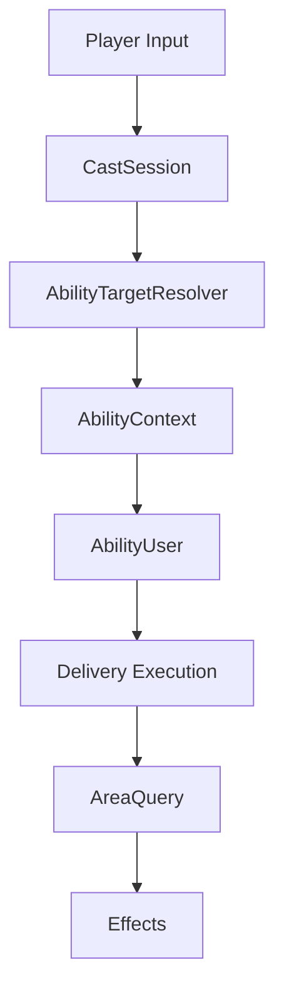

# Combat Architecture

## Project Goal

This project focuses on building scalable and reusable
gameplay combat architecture rather than content-heavy gameplay.

The primary focus is:
- modular execution
- reusable combat systems
- separation of concerns
- extensibility
- maintainability

---

# Core Architecture Philosophy

The combat system separates:

- targeting intent
- execution orchestration
- spatial querying
- gameplay effects

This prevents individual systems from accumulating unrelated responsibilities.

---

# High-Level Flow

---

# Core Systems

## AbilityUser
Coordinates ability execution and delivery routing.

Responsibilities:
- cooldown management
- execution routing
- delivery orchestration
- effect coordination

Does NOT:
- perform targeting logic
- contain spatial query math

---

## AbilityTargetResolver
Converts player intent into runtime targeting data.

Responsibilities:
- raycasts
- point selection
- direction generation
- target acquisition

---

## AreaQuery
Handles reusable spatial combat queries.

Responsibilities:
- overlap queries
- cone filtering
- radius filtering
- candidate gathering

Does NOT:
- apply gameplay effects
- know ability rules

---

## AbilityContext
Carries runtime cast data between systems.

Current Data:
- target
- point
- direction
- hasPoint

---

# Current Delivery Types

- Instant
- Projectile
- Delayed

---

# Current Area Shapes

- None
- Sphere
- Cone