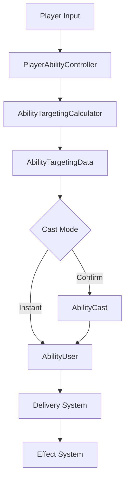

# Modular Ability Combat Framework (Unity)

A Unity combat framework built to explore reusable gameplay systems and combat architecture.

The goal of this project is to create abilities that can be added, modified, and combined through configuration rather than rewriting gameplay code.

---

<p align="center">
  
</p>

<p align="center">
  Projectile execution applying Damage and Slow effects.
</p>

<p align="center">
  
</p>

<p align="center">
  Swapping DamageEffect for HealEffect through ScriptableObject configuration.
</p>

<p align="center">
  
</p>

<p align="center">
  The same projectile execution applying a HealEffect without code changes.
</p>

---

# Trello

https://trello.com/b/lMqxyECt/modular-ability-combat-framework-project

---

# 🧠 Core Idea

The framework separates combat into three independent concerns:

* **Abilities** = What the player uses
* **Delivery** = How the ability reaches targets
* **Effects** = What gameplay outcome occurs

This makes it easier to create new abilities by reusing existing systems instead of writing new code for every ability.

---

# 🏗 Architecture Overview



---

# 🔄 Example Execution Flow

Fireball (Projectile Ability)

```text
Input
→ PlayerAbilityController
→ AbilityTargetingCalculator
→ AbilityTargetingData
→ AbilityUser
→ Projectile Delivery
→ Damage Effect
```

Meteor (Confirm Cast Ability)

```text
Input
→ PlayerAbilityController
→ AbilityCast
→ AbilityTargetingCalculator
→ AbilityTargetingData
→ Confirm Cast
→ AbilityUser
→ Delayed Delivery
→ Damage Effect
```

---

# 🎯 System Responsibilities

Each system has a single responsibility within the ability pipeline.

| System                     | Responsibility                                         |
| -------------------------- | ------------------------------------------------------ |
| PlayerAbilityController    | Reads player input and starts ability flow             |
| AbilityCast                | Manages temporary cast lifecycle and confirmation flow |
| AbilityTargetingCalculator | Builds and validates targeting information             |
| AbilityTargetingData       | Stores targeting information for the current cast      |
| AbilityUser                | Manages cooldowns and ability usage                    |
| Delivery Systems           | Control how abilities reach targets                    |
| Effects                    | Apply gameplay outcomes                                |

Design Rule:

* Systems own one responsibility.
* Gameplay effects never bypass the effect system.

---

# ⚙️ System Overview

## 1. Ability Layer

Abilities are stored as ScriptableObjects.

An ability defines:

* Targeting Type (Point / Target / Self)
* Cast Mode (Instant / Confirm)
* Delivery Type (Instant / Projectile / Delayed / Chain)
* Area Shape (None / Sphere / Cone)
* Effect List

Abilities contain configuration only.

They do not contain gameplay logic.

---

## 2. Targeting Layer

The targeting system determines where an ability should be used and which targets are valid.

Responsibilities include:

* Aim direction calculation
* Aim point calculation
* Target detection
* Range validation
* Angle validation

Targeting information is stored in AbilityTargetingData and passed through the execution pipeline.

---

## 3. Cast Layer

Abilities using Confirm Cast create a temporary AbilityCast instance.

Responsibilities include:

* Maintaining cast state
* Updating targeting information
* Displaying targeting indicators
* Confirming or cancelling casts

This system only exists while the player is preparing a confirm-cast ability.

---

## 4. Delivery Layer

Delivery determines how an ability reaches its targets.

Current delivery types:

### Instant

Resolves immediately.

### Projectile

Spawns a projectile and resolves on impact.

### Delayed

Waits before resolving.

### Chain

Transfers effects between valid targets.

---

## 5. Effect Layer

Effects define gameplay outcomes.

Current examples:

* Damage
* Heal
* Slow

Design Rule:

Effects are the only systems allowed to directly modify gameplay state.

Abilities and delivery systems never directly modify health, movement speed, or combat stats.

---

# 🔥 Example Abilities

## Fireball

Projectile ability that explodes on impact.

Demonstrates:

* Projectile delivery
* Area damage
* Reusable effects

---

## Chain Lightning

Ability that jumps between nearby enemies.

Demonstrates:

* Multi-target execution
* Chaining logic
* Target filtering

---

## Cleave

Instant frontal attack.

Demonstrates:

* Cone targeting
* Instant execution
* Directional hit detection

---

## Meteor

Targeted delayed impact.

Demonstrates:

* Confirm cast flow
* Delayed delivery
* Position-based execution

---

# 🧩 Technical Highlights

* Data-driven ability creation using ScriptableObjects
* Shared targeting pipeline across all abilities
* Modular delivery architecture
* Reusable effect system
* Confirm-cast and instant-cast support
* Clear separation of responsibilities
* Easily expandable ability pipeline

---

# 🧪 Design Goals

This project is intended as a gameplay systems portfolio project.

The primary goals are:

* Build reusable gameplay systems
* Practice clean system architecture
* Build systems with clear responsibilities
* Create a consistent ability workflow
* Support extension without modifying core systems

---

# 🚧 Future Improvements

* Buff / debuff framework
* Status effect system
* Animation-driven ability execution
* Advanced cast interruption framework
* Gameplay tags and ability requirements
* AI integration using the same ability pipeline

---

# 📌 Summary

Abilities define configuration.

Targeting determines intent.

Delivery determines how abilities execute.

Effects determine gameplay outcomes.

The result is a modular combat framework that can be extended with new abilities while minimizing changes to existing systems.

---

# Why I Built This

I enjoy building gameplay systems and understanding how different combat mechanics fit together.

Many games contain abilities, cooldowns, projectiles, targeting systems, status effects, and execution pipelines. Rather than implementing each ability as a one-off solution, I wanted to explore how these mechanics could be built from reusable systems.

This project started as an experiment to see how a reusable combat system could be built. Along the way, it became a way to practice gameplay programming, system design, and building systems that are easy to extend.

One interesting side effect is that I now analyze abilities in games differently. When playing games such as Overwatch or League of Legends, I often find myself breaking abilities down into targeting, delivery, and effect layers and thinking about how they could be implemented within a reusable framework.
